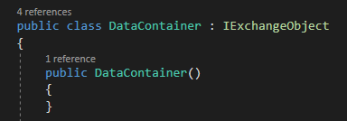
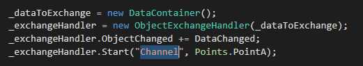

# IPCPipesCoreObjectExchangeService
This library allows a simple exchange of the properties of an object between two applications.

# Remark
I made this library with the intend to make it as simple to use as possible. I needed a simple way to automatically send a start trigger with parameters to another application.

# Usage
You need to create a library which contains the object you want to exchange between your applications.
The object must implement the IExchangeObject interface.

In your applications create a instance of the ObjectExchangeHandler, which takes an instance of your object.
Once you have created an instance, you have to start the object exchange. To do that you have to choose a pipe name (use the same pipe name in both applications) and set the point (use PointA in one app and PointB in the other app)

Once started, the exchangehandlers automatically try to connect to each other, until you stop the object exchange.

To trigger an exchange, simply raise the event ObjectChanged in your object. When the handler in the other application recieves the new object data, it in return raises the event ObjectChanged in the handler. You can use this to, for example update the data in your UI (data is beeing send asynchron, which is why the event is not called from the UI thread).